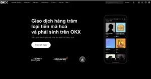
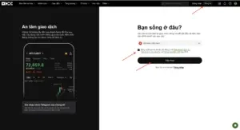
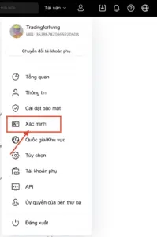
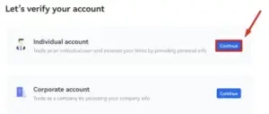
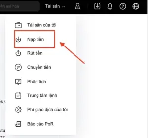
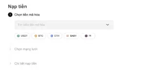
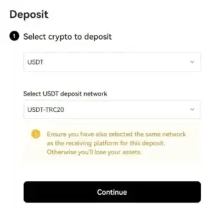
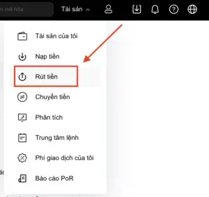
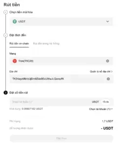

# What is OKX Exchange? Complete Registration Guide

Wondering if OKX is the right crypto trading platform for you? This guide walks you through everything from account setup to your first deposit—covering fee structures, security features, and practical trading tips that help both beginners and experienced traders navigate this global exchange with confidence.

---

## What is OKX Exchange?

OKX Exchange (formerly OKEX) is a cryptocurrency trading platform founded by Star Xu in January 2014 in China. The exchange provides users with secure, convenient, and intelligent services for storing and converting crypto assets.

OKX supports most coins and tokens available globally while integrating leading security technologies. The platform has grown significantly since its launch, now serving users across multiple countries with a comprehensive suite of trading products.

## OKX Exchange Overview

Founded in April 2018 and registered in Singapore, OKX was established by senior experts from Wall Street's blockchain and finance sectors. The exchange now operates multiple representative offices worldwide with over 500 employees providing trading services across numerous countries.

Since its establishment, OKX has obtained operating licenses in five countries: Switzerland, Canada, Australia, and the United States. The platform supports more than 10 different languages, making it accessible to a global user base.

In 2019, OKX achieved an impressive milestone by capturing 5% of the global cryptocurrency trading market capitalization.

## Key Features of OKX

### Advantages

- High trading volume with excellent liquidity
- Supports 10 different languages, including Vietnamese
- Multiple trading formats: Spot Trading, Margin Trading, OTC, futures contracts, and options
- Various payment options for buying crypto: Visa/Mastercard, bank transfers, Google Pay, and more
- Supports trading over 250 digital assets with low fees
- Fast transaction processing speed
- Available on multiple platforms: Windows, MacOS extensions and Android, iOS mobile apps
- 24/7 customer support through Telegram, email, and website

### Disadvantages

- Interface could be more intuitive and user-friendly
- Product offerings, while diverse, haven't established clear differentiation
- Past security incident involving user account hacking raised concerns about platform security
- Novel products like OK Pool and OK Piggy may confuse newcomers

## Trading Fees on OKX

### Fee Structure

OKX distinguishes between **regular users and VIP users** based on 30-day trading volume for both main trading accounts and derivative trading accounts.

- Regular users (with 30-day trading volume under 10,000 BTC) are divided into 5 tiers based on the amount of OKB tokens they hold
- VIP users are categorized by trading volume

OKX also differentiates fees between maker and taker orders:

- **Maker fees** range from 0.02% to 0.8% per transaction
- **Taker fees** range from 0.03% to 0.1% depending on account level

When calculating fee tiers, users receive discounts for the highest tier among spot markets, futures contracts, perpetual swaps, and options.

**Deposit fees:** No fees for deposits. However, cash deposits through bank transfers may incur flexible fees depending on the payment channel.

**Withdrawal fees:** Vary by coin—for example, ETH costs 0.01 ETH, USDT costs 2 USDT, BTC costs 0.0005 BTC.

## How to Register an OKX Account

The account creation process on OKX is quick and straightforward:

**Step 1:** 👉 [Access the registration page and start trading crypto with competitive fees](https://www.okx.com/join/47044926)

**Step 2:** Choose your registration method—mobile phone number or email address. You can also log in with existing Telegram or Google accounts. This guide demonstrates email registration.

**Step 3:** Enter your email address and password, then click **Sign up**. Note that passwords must contain 8-32 characters with at least 1 number, 1 uppercase letter, 1 lowercase letter, and 1 symbol.

**Step 4:** Check your email for a verification code. Enter the code to successfully create your account.

## Account Verification on OKX

**Step 1:** On the homepage, click the person icon and select **Verification**.

**Step 2:** Choose between **Individual account** or **Corporate account**. Regular users should select the first option, then click **Continue**.

**Step 3:** Fill in the required information including: Country/territory of residence, first and middle names, last name, ID type (national ID, citizen ID, passport), and ID number. After entering all information, click **Submit**.

**Step 4:** If your information is accurate, you'll receive a successful verification notification and can begin trading.

To access additional features and increase withdrawal limits, you can complete KYC verification following the exchange's guidelines.

## Deposit and Withdrawal Guide for OKX

### Depositing Funds

**Step 1:** Navigate to **Assets** → Select **Deposit**.

**Step 2:** Select the coin/token you want to deposit to the exchange.

**Step 3:** Select the **Chain** → Click **Continue**.

**Step 4:** Generate and copy the wallet address or scan the QR code. If this is your first deposit, click "**Click to create address**". Copy the USDT TRC20 wallet address provided by OKX.

**Step 5:** Transfer USDT TRC20 to the newly created address. During the transfer process, pay attention to:

- Copy and verify the wallet address accurately
- Select the correct blockchain network

Once the transfer is successful and blockchain confirmation is complete, check your OKX wallet balance.

### Withdrawing Funds

**Step 1:** Go to **Assets** → select the coin/token you want to withdraw, then choose **Withdraw**.

**Step 2:** Select the token type and enter withdrawal information:

- **Address:** Destination wallet address
- **Amount:** Number of coins/tokens to withdraw
- Click **Continue**
- Confirm with OTP to complete the OKX withdrawal
  

After clicking **Continue**, wait for the exchange to process and transfer funds to your wallet address. Withdrawal times on OKX are relatively fast, with support for multiple networks.

---

## Summary

Overall, **OKX Exchange** is a margin trading platform with comprehensive functionality similar to other exchanges in the market. For traders constantly seeking exchanges with low fees and high liquidity, OKX presents a solid option.

With its simple, user-friendly interface and Vietnamese language support, the platform makes operations straightforward and efficient for users of all experience levels.

This guide has provided a comprehensive overview of OKX Exchange and practical instructions for using the platform. 👉 [Ready to experience secure crypto trading with multi-language support? Join OKX now with referral code 47044926](https://www.okx.com/join/47044926) and start trading on one of the world's leading cryptocurrency exchanges.
